# Architecture

Complete architecture documentation for daphne-core. This document covers system design, component interactions, and architectural patterns.

## Table of Contents

- [System Overview](#system-overview)
- [Adapter Pattern](#adapter-pattern)
- [Component Architecture](#component-architecture)
- [Data Flow](#data-flow)
- [Initialization Sequence](#initialization-sequence)
- [Module Dependencies](#module-dependencies)
- [State Bag Architecture](#state-bag-architecture)
- [Cache Architecture](#cache-architecture)

## System Overview

daphne-core is a framework bridge system that provides a unified API for multiple FiveM frameworks using the Adapter Design Pattern.

### High-Level Architecture

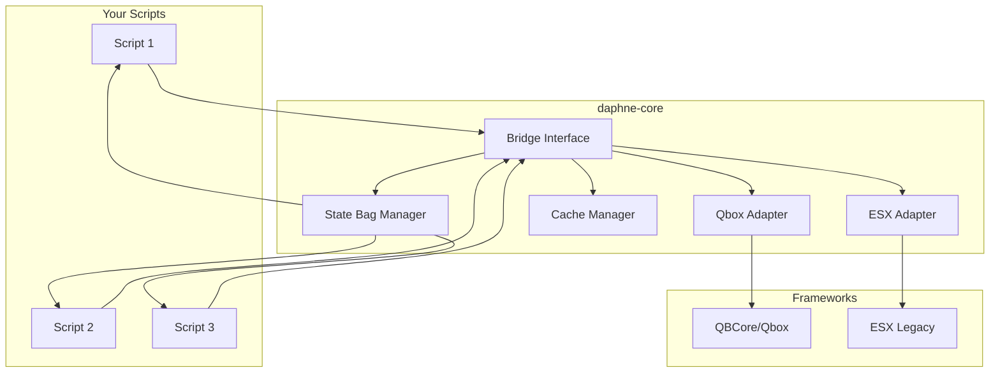

## Adapter Pattern

daphne-core uses the Adapter Design Pattern to provide a unified interface across different frameworks.

### Pattern Structure

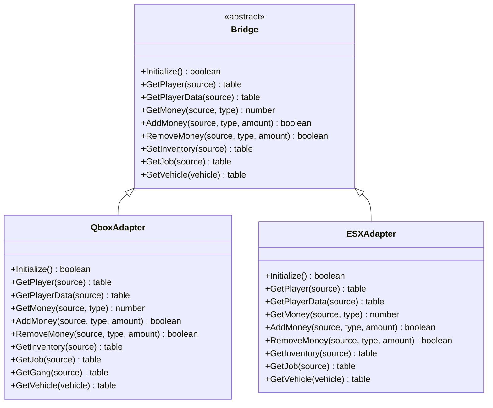

### Framework Detection Flow

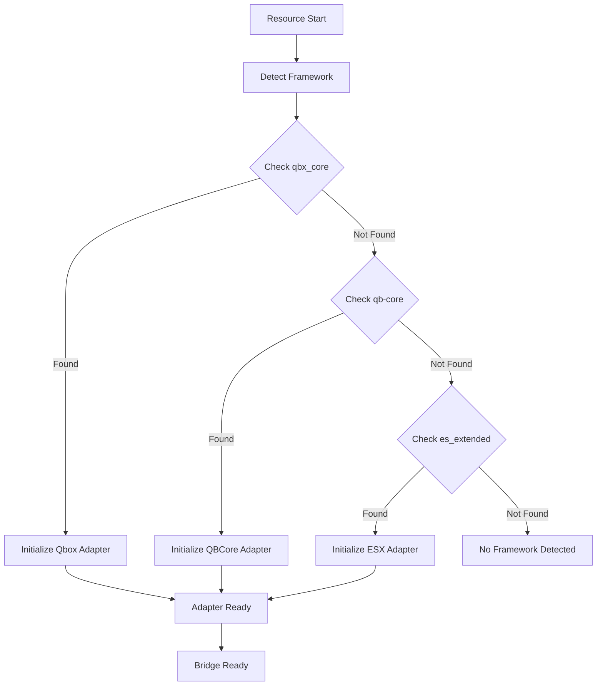

## Component Architecture

### Core Components

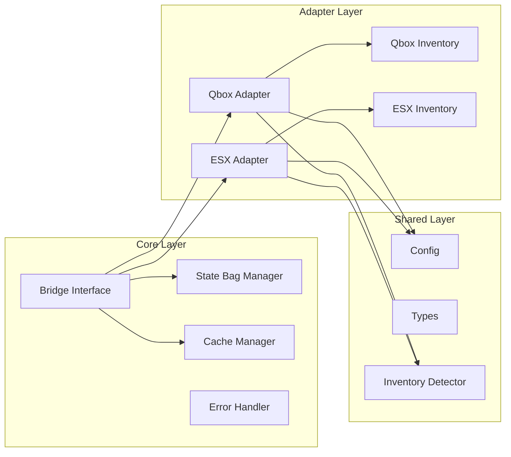

### Server Components

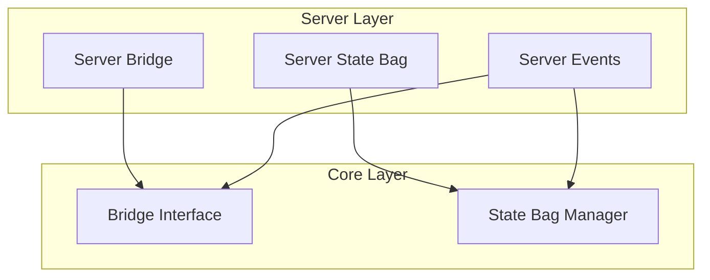

### Client Components

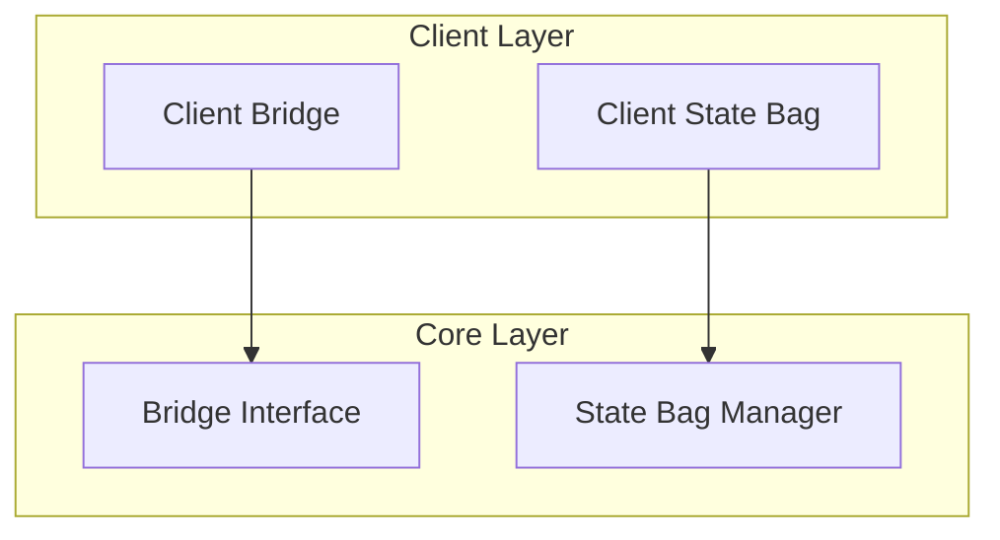

## Data Flow

### Read Operation Flow

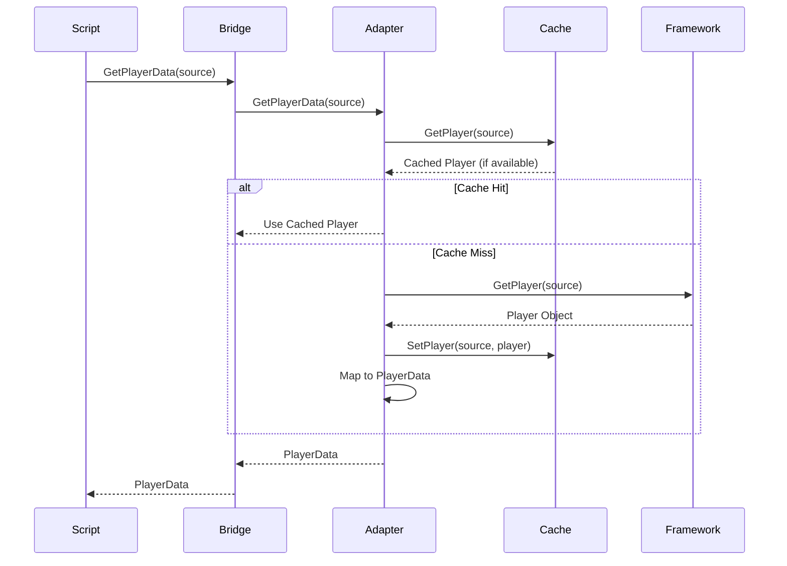

### Write Operation Flow

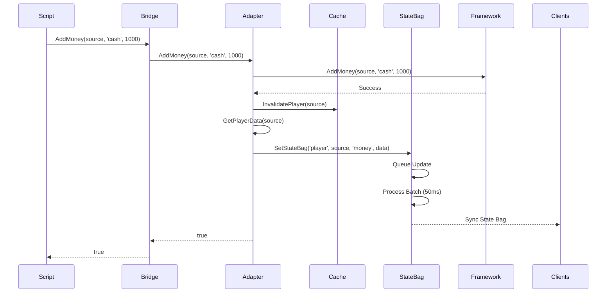

### State Bag Update Flow

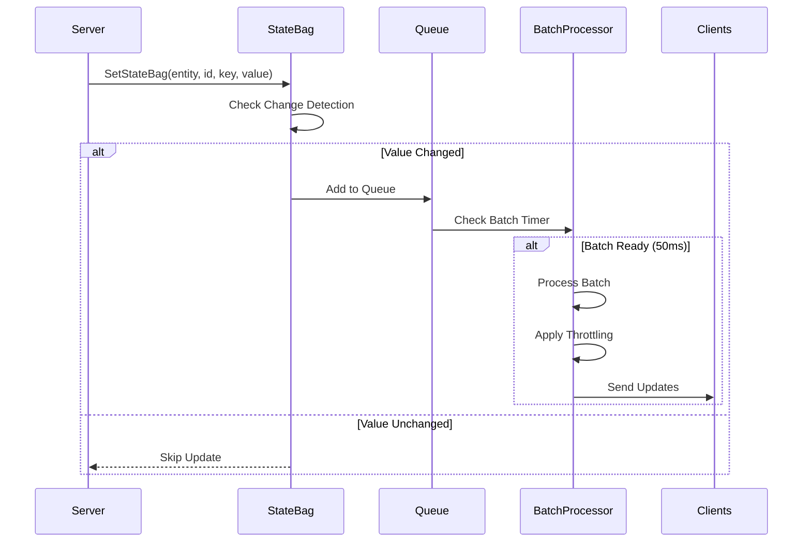

## Initialization Sequence

### Server Initialization

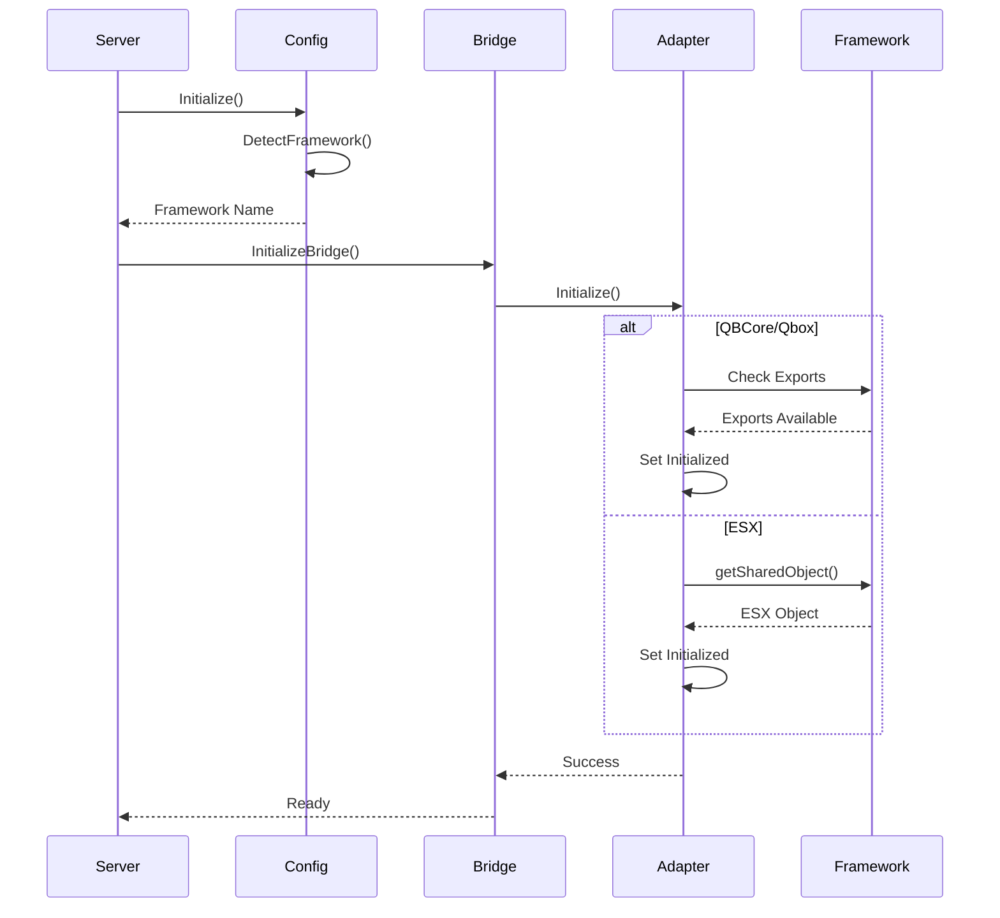

### Client Initialization

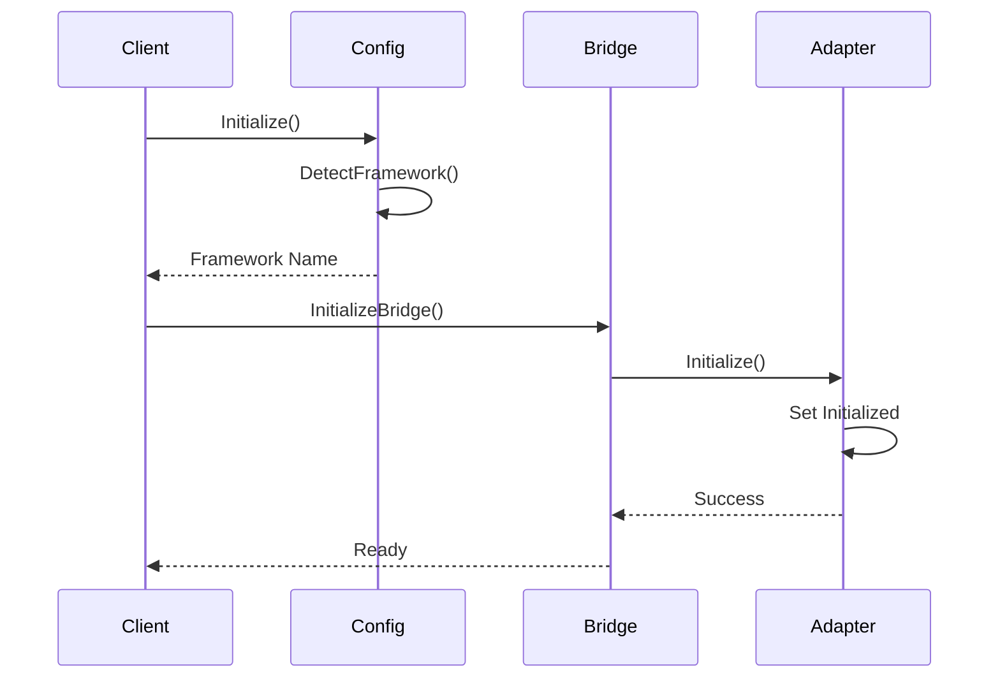

## Module Dependencies

### Dependency Graph

```mermaid
graph TD
    Types[types.lua]
    Config[config.lua]
    InventoryDetector[inventory_detector.lua]
    ErrorHandler[error_handler.lua]
    Bridge[bridge.lua]
    Cache[cache.lua]
    StateBag[statebag.lua]
    
    QboxAdapter[qbox/adapter.lua]
    QboxPlayer[qbox/player.lua]
    QboxMoney[qbox/money.lua]
    QboxInventory[qbox/inventory.lua]
    QboxJob[qbox/job.lua]
    QboxVehicle[qbox/vehicle.lua]
    
    ESXAdapter[esx/adapter.lua]
    ESXPlayer[esx/player.lua]
    ESXMoney[esx/money.lua]
    ESXInventory[esx/inventory.lua]
    ESXJob[esx/job.lua]
    ESXVehicle[esx/vehicle.lua]
    
    ServerBridge[server/bridge.lua]
    ServerStateBag[server/statebag.lua]
    ServerEvents[server/events.lua]
    
    ClientBridge[client/client.lua]
    ClientStateBag[client/statebag.lua]
    
    Types --> Config
    Types --> Bridge
    Config --> Bridge
    Config --> QboxAdapter
    Config --> ESXAdapter
    InventoryDetector --> QboxInventory
    InventoryDetector --> ESXInventory
    ErrorHandler --> Bridge
    
    Bridge --> QboxAdapter
    Bridge --> ESXAdapter
    Cache --> QboxAdapter
    Cache --> ESXAdapter
    StateBag --> QboxAdapter
    StateBag --> ESXAdapter
    
    QboxAdapter --> QboxPlayer
    QboxAdapter --> QboxMoney
    QboxAdapter --> QboxInventory
    QboxAdapter --> QboxJob
    QboxAdapter --> QboxVehicle
    
    ESXAdapter --> ESXPlayer
    ESXAdapter --> ESXMoney
    ESXAdapter --> ESXInventory
    ESXAdapter --> ESXJob
    ESXAdapter --> ESXVehicle
    
    Bridge --> ServerBridge
    Bridge --> ClientBridge
    StateBag --> ServerStateBag
    StateBag --> ClientStateBag
    
    ServerBridge --> ServerEvents
    ServerStateBag --> ServerEvents
```

### Load Order

The load order in `fxmanifest.lua` ensures dependencies are loaded before dependents:

1. **Shared Scripts** (loaded first):
   - `shared/types.lua`
   - `shared/config.lua`
   - `shared/inventory_detector.lua`
   - `core/error_handler.lua`
   - `core/bridge.lua`
   - `core/cache.lua`
   - `core/statebag.lua`
   - Adapters and their modules

2. **Server Scripts**:
   - `server/server.lua`
   - `server/bridge.lua`
   - `server/statebag.lua`
   - `server/events.lua`

3. **Client Scripts**:
   - `client/statebag.lua`
   - `client/client.lua`

## State Bag Architecture

### State Bag Manager Structure

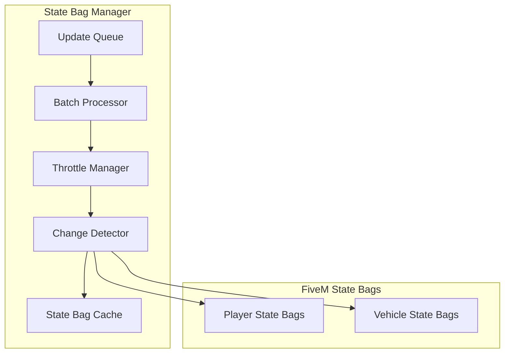

### Batch Processing Flow

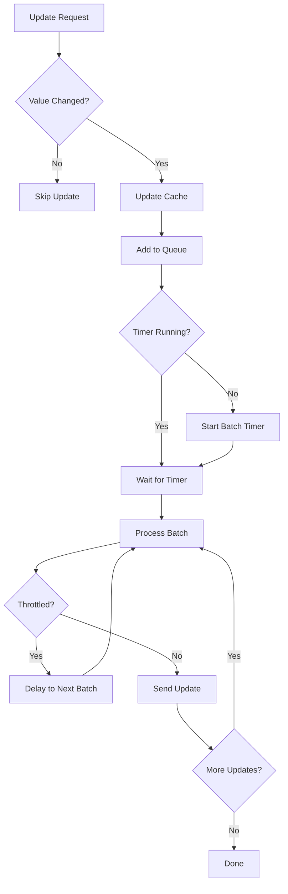

## Cache Architecture

### Cache Manager Structure

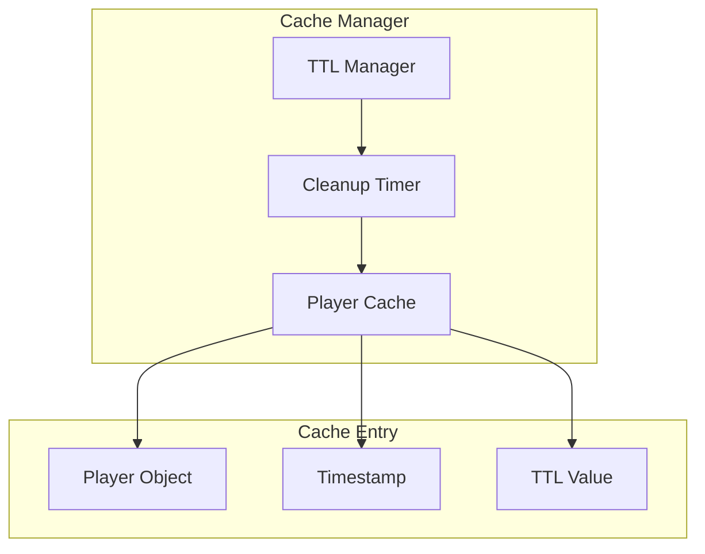

### Cache Flow

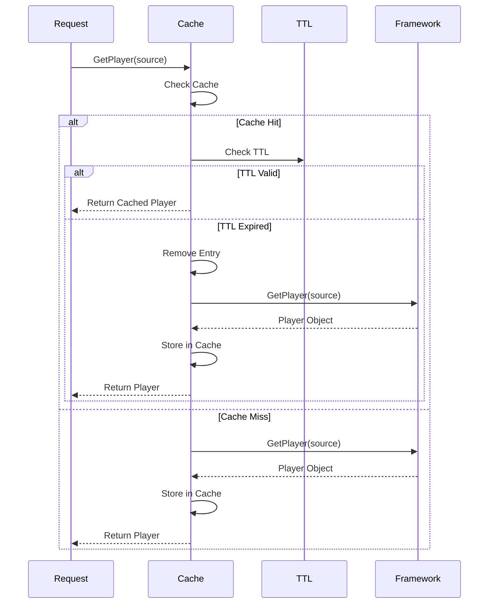

## Related Documentation

- [Adapter Pattern Guide](ADAPTER_PATTERN.md) - Adapter implementation details
- [State Bag System](STATE_BAG_SYSTEM.md) - State bag usage guide
- [Performance Guide](PERFORMANCE.md) - Performance optimizations
- [API Reference](API_REFERENCE.md) - Export function documentation

